# 📘 Diagramas Técnicos - [NOMBRE_PROYECTO]

## 📋 ÍNDICE DE DIAGRAMAS

### Por Categoría
- **Arquitectura**: [N] diagramas
- **Flujos de Proceso**: [N] diagramas
- **Modelo de Datos**: [N] diagramas
- **Secuencias**: [N] diagramas
- **Estados**: [N] diagramas
- **Despliegue**: [N] diagramas
- **Componentes**: [N] diagramas

### Por Nivel de Detalle
- **Nivel Contexto** (L1): Vista general del sistema
- **Nivel Contenedor** (L2): Principales componentes
- **Nivel Componente** (L3): Detalle interno
- **Nivel Código** (L4): Clases y relaciones

## 🏗️ DIAGRAMAS DE ARQUITECTURA

### Diagrama: Contexto del Sistema (C4-L1)
**Tipo:** Contexto
**Herramienta:** Mermaid
**Propósito:** Mostrar el sistema en su entorno con actores externos

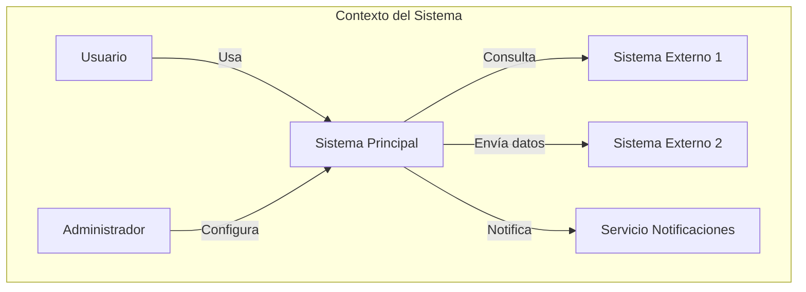

**Elementos Clave:**
- **Actores**: [DESCRIPCIÓN DE CADA ACTOR]
- **Interacciones**: [TIPO DE COMUNICACIÓN]
- **Límites**: [QUÉ ESTÁ DENTRO Y FUERA]

### Diagrama: Contenedores (C4-L2)
**Tipo:** Contenedores
**Herramienta:** Mermaid
**Propósito:** Mostrar los contenedores principales y sus interacciones

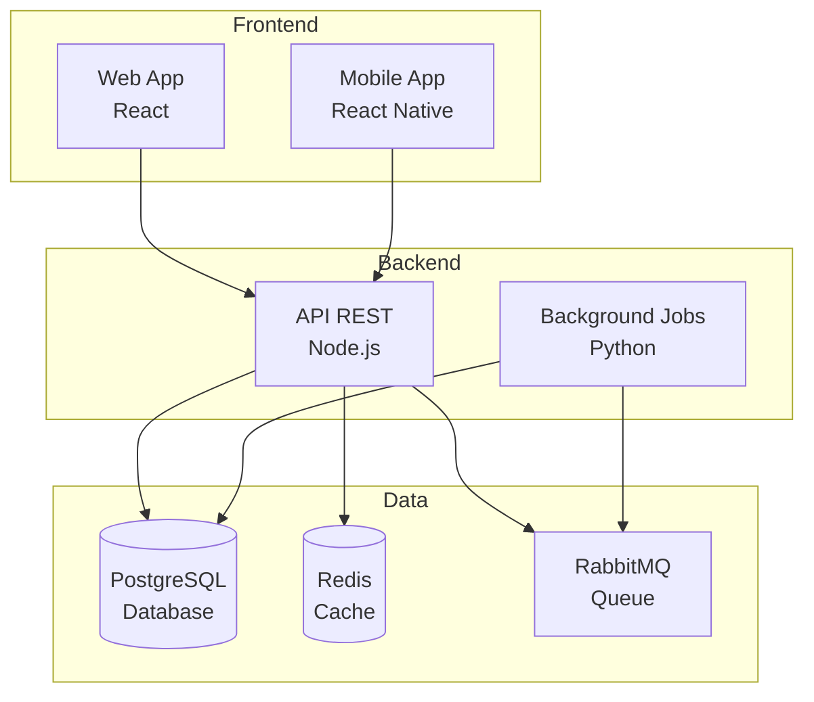

**Tecnologías:**
| Contenedor | Tecnología | Puerto | Protocolo |
|------------|------------|--------|-----------|
| [Web App] | [React] | [3000] | [HTTPS] |
| [API] | [Node.js] | [8080] | [REST] |
| [Database] | [PostgreSQL] | [5432] | [TCP] |

### Diagrama: Componentes (C4-L3)
**Tipo:** Componentes
**Herramienta:** Mermaid
**Propósito:** Detalle interno de un contenedor

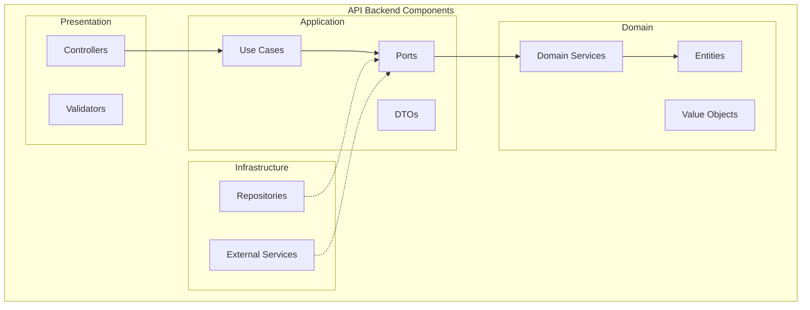

## 🔄 DIAGRAMAS DE FLUJO

### Diagrama: Flujo Principal de Negocio
**Tipo:** Flowchart
**Herramienta:** Mermaid
**Propósito:** Proceso principal del sistema

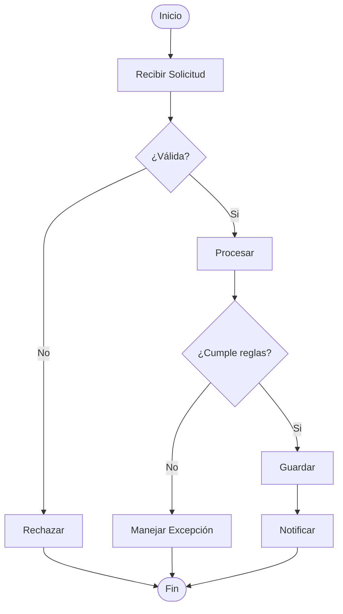

**Decisiones Clave:**
| Punto de Decisión | Criterios | Acción SI | Acción NO |
|-------------------|-----------|-----------|-----------|
| [Validación] | [REGLAS] | [CONTINUAR] | [RECHAZAR] |
| [Reglas Negocio] | [CRITERIOS] | [PROCESAR] | [EXCEPCIÓN] |

### Diagrama: Proceso de Autenticación
**Tipo:** Flowchart
**Herramienta:** Mermaid
**Propósito:** Flujo de autenticación y autorización

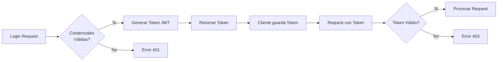

## 📊 DIAGRAMAS DE SECUENCIA

### Diagrama: Secuencia de Creación
**Tipo:** Sequence
**Herramienta:** Mermaid
**Propósito:** Interacción temporal entre componentes

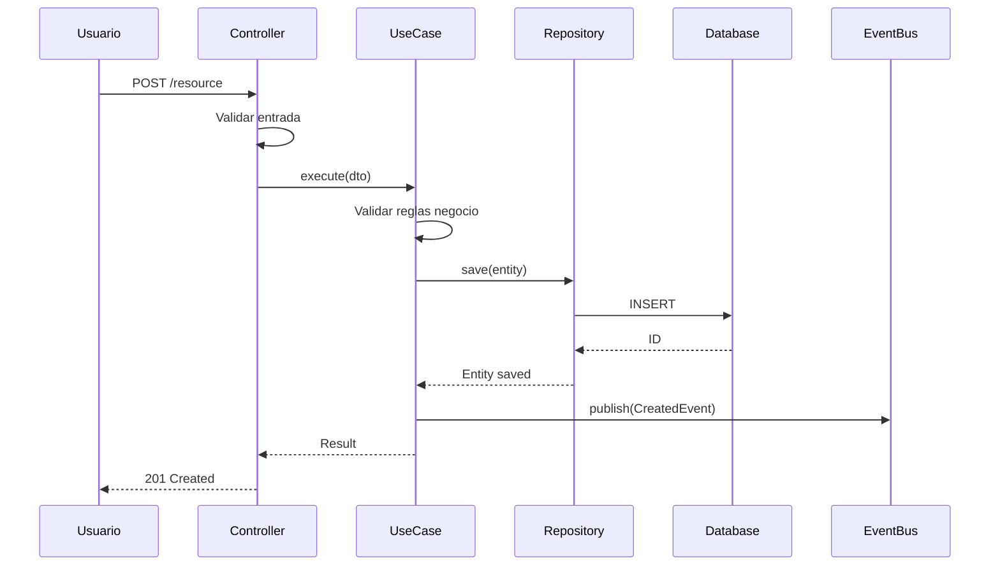

**Mensajes:**
| De | A | Mensaje | Tipo | Respuesta |
|----|---|---------|------|-----------|
| [Usuario] | [Controller] | [POST /resource] | [Sync] | [201] |
| [UseCase] | [Repository] | [save()] | [Sync] | [Entity] |
| [UseCase] | [EventBus] | [publish()] | [Async] | [None] |

## 🔀 DIAGRAMAS DE ESTADO

### Diagrama: Estados de una Entidad
**Tipo:** State
**Herramienta:** Mermaid
**Propósito:** Ciclo de vida de entidad principal

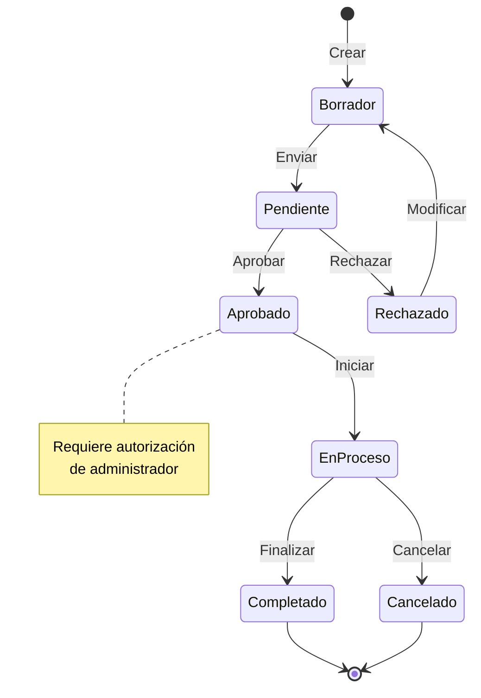

**Transiciones:**
| Estado Origen | Estado Destino | Evento | Condiciones | Acciones |
|---------------|----------------|--------|-------------|----------|
| [Borrador] | [Pendiente] | [Enviar] | [Completo] | [Notificar] |
| [Pendiente] | [Aprobado] | [Aprobar] | [Autorizado] | [Log] |

## 💾 DIAGRAMAS DE DATOS

### Diagrama: Modelo Entidad-Relación
**Tipo:** ERD
**Herramienta:** Mermaid
**Propósito:** Estructura de base de datos

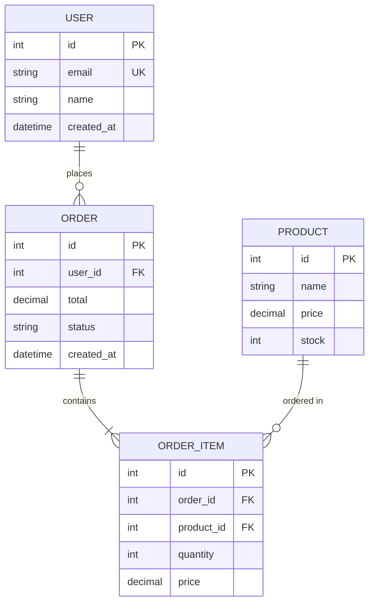

**Relaciones:**
| Entidad A | Relación | Cardinalidad | Entidad B | Constraint |
|-----------|----------|--------------|-----------|------------|
| [User] | places | 1:N | [Order] | CASCADE |
| [Order] | contains | 1:N | [OrderItem] | CASCADE |
| [Product] | ordered_in | 1:N | [OrderItem] | RESTRICT |

## 🚀 DIAGRAMAS DE DESPLIEGUE

### Diagrama: Infraestructura de Producción
**Tipo:** Deployment
**Herramienta:** Mermaid
**Propósito:** Arquitectura de despliegue

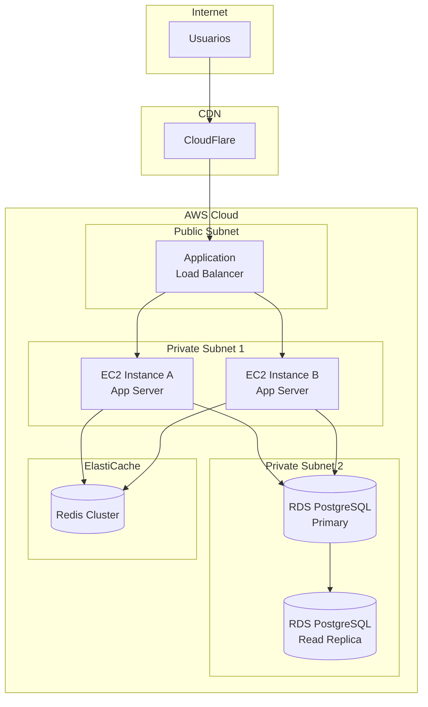

**Especificaciones:**
| Componente | Tipo | Especificación | Cantidad | Auto-scaling |
|------------|------|----------------|----------|--------------|
| [EC2] | [t3.large] | [2CPU/8GB] | [2-10] | [Si] |
| [RDS] | [db.r5.large] | [2CPU/16GB] | [1+1] | [No] |
| [Redis] | [cache.m5.large] | [2CPU/8GB] | [3] | [No] |

## 🔧 DIAGRAMAS DE CLASES

### Diagrama: Modelo de Dominio
**Tipo:** Class
**Herramienta:** Mermaid
**Propósito:** Estructura de clases del dominio

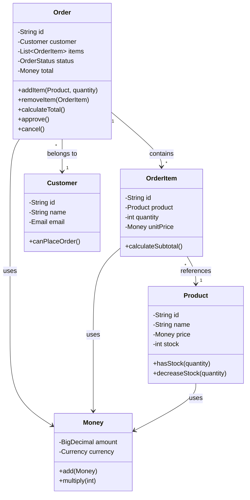

**Patrones Aplicados:**
| Patrón | Clases Involucradas | Propósito |
|--------|-------------------|-----------|
| [Aggregate] | [Order, OrderItem] | [Consistencia] |
| [Value Object] | [Money, Email] | [Inmutabilidad] |
| [Entity] | [Customer, Product] | [Identidad] |

## 📐 DIAGRAMAS DE ACTIVIDADES

### Diagrama: Proceso de Negocio
**Tipo:** Activity
**Herramienta:** Mermaid
**Propósito:** Actividades y decisiones del proceso

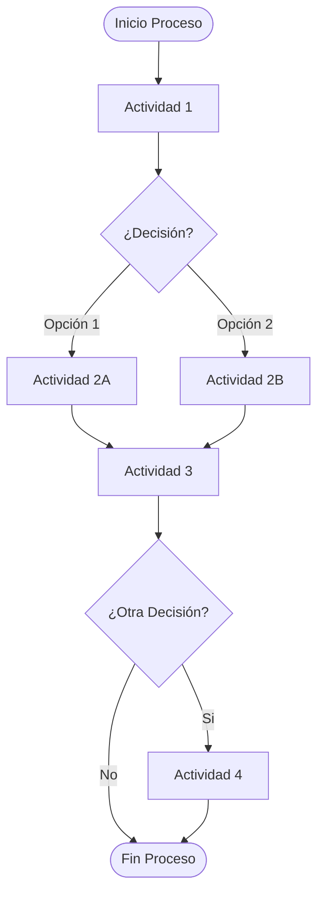

## 🎨 CONVENCIONES DE DIAGRAMAS

### Colores y Estilos
| Elemento | Color | Estilo | Significado |
|----------|-------|--------|-------------|
| Entidad Externa | Gris | Punteado | Fuera del sistema |
| Componente Core | Azul | Sólido | Lógica principal |
| Base de Datos | Verde | Cilindro | Persistencia |
| Servicio Externo | Naranja | Nube | Integración |
| Error/Excepción | Rojo | Doble línea | Flujo de error |

### Nomenclatura
- **Nodos**: PascalCase para clases, camelCase para instancias
- **Relaciones**: Verbos en minúsculas
- **Cardinalidad**: Notación UML (1, *, 0..1, 1..*)
- **Flechas**: → para flujo, -- para asociación, ..> para dependencia

### Niveles de Detalle
| Nivel | Audiencia | Contenido | Herramienta Sugerida |
|-------|-----------|-----------|---------------------|
| L1 | Stakeholders | Contexto general | Draw.io |
| L2 | Arquitectos | Contenedores | Mermaid |
| L3 | Desarrolladores | Componentes | PlantUML |
| L4 | Implementadores | Clases/Código | IDE/Mermaid |

## 🛠️ HERRAMIENTAS Y EXPORTACIÓN

### Herramientas Recomendadas
| Herramienta | Tipo de Diagrama | Formato Exportación | Versionable |
|-------------|------------------|-------------------|-------------|
| Mermaid | Todos | SVG, PNG | Si (texto) |
| PlantUML | UML | SVG, PNG | Si (texto) |
| Draw.io | Complejos | XML, SVG, PNG | Si (XML) |
| Lucidchart | Colaborativos | PDF, PNG | No |
| C4-PlantUML | C4 Model | SVG, PNG | Si (texto) |

### Ubicación de Archivos
```
/docs/projects/[CODIGO]/diagrams/
├── source/           # Archivos fuente (.mmd, .puml, .xml)
├── exported/         # Imágenes exportadas (.svg, .png)
└── README.md        # Índice y descripción de diagramas
```

## 📝 MANTENIMIENTO DE DIAGRAMAS

### Checklist de Actualización
- [ ] Diagrama refleja el estado actual del sistema
- [ ] Versión y fecha actualizadas
- [ ] Exportación en formato versionable
- [ ] Exportación en formato visual
- [ ] Documentación de cambios
- [ ] Enlaces desde documentos relacionados

### Registro de Cambios
| Fecha | Diagrama | Cambio | Responsable | Razón |
|-------|----------|--------|-------------|-------|
| [FECHA] | [NOMBRE] | [DESCRIPCIÓN] | [AGENTE] | [MOTIVO] |

## 🔗 REFERENCIAS

### Documentación Relacionada
- [Architecture Doc](TSD-[CODIGO]-003-architecture.md)
- [Domain Doc](TSD-[CODIGO]-001-domain.md)
- [Database Doc](TSD-[CODIGO]-002-database.md)

### Recursos de Diagramación
- [Mermaid Live Editor](https://mermaid.live)
- [PlantUML Server](http://www.plantuml.com/plantuml)
- [C4 Model](https://c4model.com)
- [UML Guide](https://www.uml.org)

---

**Documento Creado:** [FECHA]
**Autor:** DOCUMENT-Agent
**Última Actualización:** [FECHA]
**Herramienta Principal:** Mermaid

<!-- 
INSTRUCCIONES PARA AGENTES:

1. DOCUMENT-Agent:
   - Crear/actualizar diagramas después de cambios
   - Mantener consistencia con código
   - Exportar en formatos versionables

2. Todos los Agentes:
   - Notificar cambios que afecten diagramas
   - Validar que diagramas reflejan realidad
   - Usar diagramas como referencia

3. QUALITY-Agent:
   - Verificar actualización de diagramas
   - Validar consistencia con implementación
   - Revisar convenciones

Los diagramas son DOCUMENTACIÓN VISUAL
Deben estar SIEMPRE actualizados
Un diagrama vale más que mil palabras
-->
