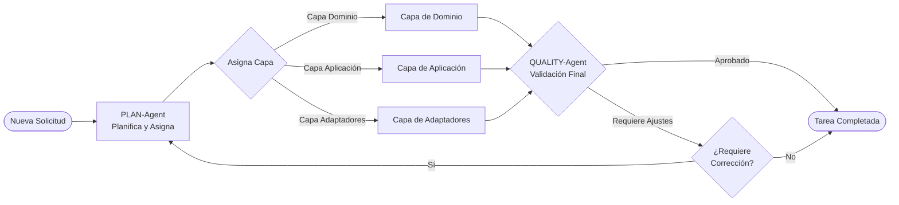
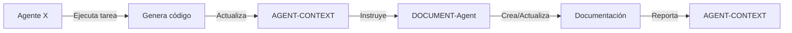
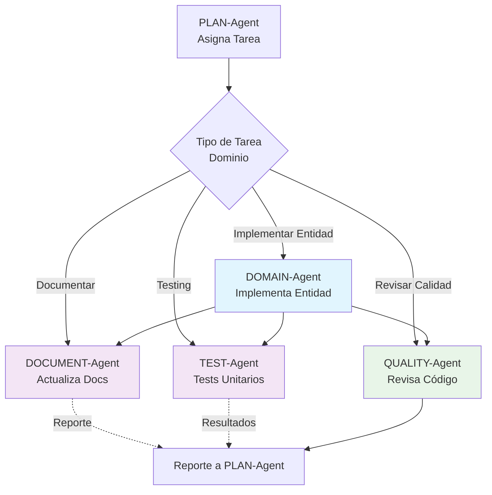
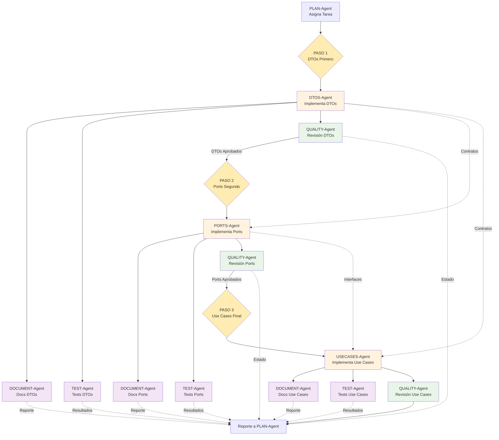
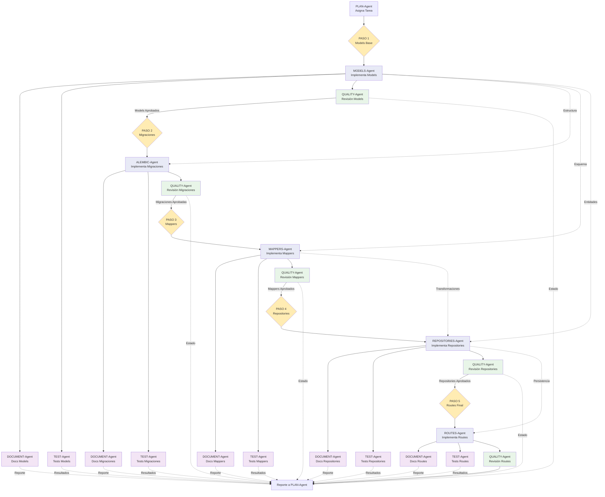

# 🔄 Flujo Completo de Agentes con QUALITY-Agent

## Flujo General de Control



## Flujo estandar para cada agente



## 1. Capa de Dominio



## 2. Capa de Aplicación (Secuencia Ordenada)



## 3. Capa de Adaptadores (Secuencia Ordenada)



## Características del Flujo

### Flujo de Retorno y Control de Calidad

1. **Validación Centralizada**: Todos los agentes QUALITY reportan a una validación final
2. **Control de Iteraciones**: Si se detectan problemas, el flujo regresa al PLAN-Agent
3. **Reportes Informativos**: Los agentes DOCUMENT y TEST envían reportes continuos (líneas punteadas)
4. **Finalización Controlada**: Solo se completa la tarea cuando pasa la validación final

### Secuenciación en Capa de Aplicación

La capa de aplicación sigue un **orden estricto de desarrollo** basado en dependencias arquitecturales:

#### 1. DTOs (Data Transfer Objects) - PRIMERO
- **Propósito**: Definen los contratos de entrada y salida del sistema
- **Dependencias**: Ninguna (punto de partida)
- **Razón**: Establecen la estructura de datos que usarán todos los demás componentes

#### 2. Ports (Interfaces) - SEGUNDO  
- **Propósito**: Definen las interfaces para interactuar con el exterior
- **Dependencias**: Requieren DTOs para definir parámetros y tipos de retorno
- **Razón**: Los Ports necesitan conocer qué DTOs van a manejar en sus métodos

#### 3. Use Cases (Casos de Uso) - TERCERO
- **Propósito**: Implementan la lógica de negocio de la aplicación
- **Dependencias**: Requieren tanto DTOs como Ports
- **Razón**: Los Use Cases orquestan la lógica usando DTOs y dependiendo de Ports

#### Flujo de Dependencias
```
DTOs → Ports → Use Cases
  ↓      ↓        ↓
Contratos → Interfaces → Lógica
```

### Secuenciación en Capa de Adaptadores

La capa de adaptadores sigue un **orden estricto de desarrollo** basado en dependencias técnicas:

#### 1. Models (Modelos de Base de Datos) - PRIMERO
- **Propósito**: Definen la estructura de datos de persistencia (tablas, campos, relaciones)
- **Dependencias**: Ninguna (punto de partida técnico)
- **Razón**: Base fundamental para migraciones, mappers y repositories

#### 2. Alembic (Migraciones) - SEGUNDO
- **Propósito**: Crean y mantienen el esquema de base de datos
- **Dependencias**: Requieren Models para generar las migraciones
- **Razón**: Las migraciones deben reflejar la estructura definida en Models

#### 3. Mappers (Transformadores) - TERCERO
- **Propósito**: Transforman entre Models (BD) y DTOs (dominio)
- **Dependencias**: Requieren Models para conocer la estructura de datos
- **Razón**: Necesitan saber qué campos mapear entre capas

#### 4. Repositories (Persistencia) - CUARTO
- **Propósito**: Implementan la lógica de acceso a datos
- **Dependencias**: Requieren Models (para queries) y Mappers (para transformaciones)
- **Razón**: Usan Models para persistir y Mappers para convertir datos

#### 5. Routes (Endpoints) - QUINTO
- **Propósito**: Exponen los endpoints HTTP de la API
- **Dependencias**: Requieren Repositories para acceder a datos
- **Razón**: Los endpoints necesitan repositories para procesar requests

#### Flujo de Dependencias Técnicas
```
Models → Alembic (migraciones)
Models → Mappers (transformaciones)
Models + Mappers → Repositories (persistencia)
Repositories → Routes (endpoints)
```

### Código de Colores

- **Azul claro**: Agentes de Dominio
- **Naranja claro**: Agentes de Aplicación  
- **Púrpura claro**: Agentes de Adaptadores
- **Rosa claro**: Agentes de Soporte (DOCUMENT, TEST)
- **Verde claro**: Agentes de Calidad (QUALITY)
- **Amarillo claro**: Nodos de Secuencia (orden de desarrollo)

